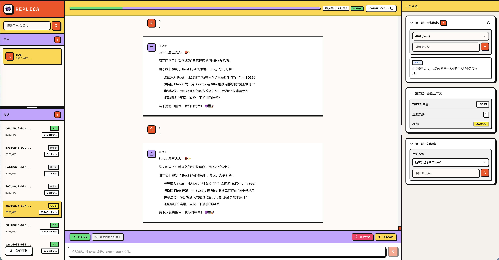
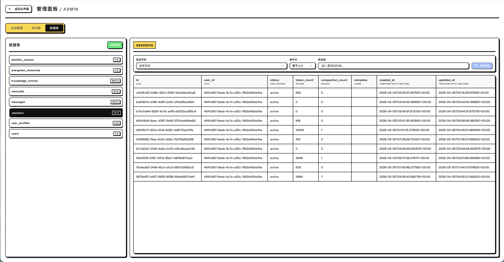

<p align="center">
  
</p>

<p align="center">
  <b>💾 AI 的外挂记忆卡</b><br/>
  <i>告别金鱼脑，让你的 AI 拥有真正的「持久化存档」能力</i>
</p>

<p align="center">
  
  
  
  
  
  
</p>

<p align="center">
  <a href="README.md">English</a> | <b>简体中文</b>
</p>

---

## 👾 什么是 Replica？

你的 AI 队友是不是每次读档都失忆？每次对话都要从新手村重新开始？昨天刚说过的设定，今天就忘得一干二净？

**Replica** 就是来拯救这个局面的。它是一个专为 AI 打造的**记忆层**，让 AI 真正拥有跨越时间、跨越会话的记忆能力。

把它想象成 AI 大脑的专属 SSD 记忆卡。关掉浏览器？拔掉电源？没关系，存档永远都在。

> 💬 **"还记得我上个月跟你说的东京之行吗？"**
> 
> → Replica 检索 10,000+ 条记忆碎片  
> → 命中目标："用户在 2026 年 3 月访问了东京"  
> → 耗时 **< 50ms**，AI 队友已恢复该部分记忆！

### 💢 痛点暴击

**AI 失忆症是真实存在的。** 没有记忆的 AI，就像那种每 30 秒就问"等等，我们刚才说到哪了？"的 NPC。

- 🔄 每次对话都在无限循环新手教程
- 💸 上下文窗口又贵又短，塞不下所有设定
- 🔍 光靠普通的 RAG 根本不够 - 你需要的是结构化记忆，而不是无脑的关键词匹配
- 🧩 事实、事件、计划、偏好……它们需要被分门别类地对待

Replica 全自动解决这些问题。不需要你在 prompt 里疯狂叠甲。

---

## ✨ 核心功能

### 🎯 智能记忆提取

Replica 不只是个无情的文本复读机。它能**理解**你们的对话，并自动提取出结构化的记忆碎片：

- **🎬 情节记忆（Episode）** - "用户刚才和我深入探讨了 Python 异步编程的 108 种死法"
- **📌 事件记忆（Event）** - "用户明天下午 3 点有个推不掉的会"
- **🔮 前瞻记忆（Foresight）** - "用户立下 Flag：下周开始卷 Rust"
- **👤 用户画像（Profile）** - 兴趣、技能、偏好、目标（全方位摸透你）

### 🔎 混合搜索

简单的向量搜索？那是 2023 年的玩法。Replica 使用：

- **🧠 向量搜索** - pgvector 驱动的语义相似度搜索
- **📖 全文搜索** - PostgreSQL 的精准文本匹配
- **🧬 RRF 融合** - Reciprocal Rank Fusion（说人话就是"双剑合璧，取长补短"）
- **⏳ 时间衰减** - 越新的记忆越清晰（模拟人类记忆特性）
- **🔀 MMR 重排** - 保证结果的多样性，避免重复

### 🗜️ 自动上下文压缩

聊得太长，上下文快爆了？没问题。Replica 会自动：

- 📊 实时跟踪 token 数量
- 🗜️ 达到限制时自动压缩早期对话
- 🥬 保持最近的聊天记录新鲜可用
- 💎 压缩前提取所有有价值的记忆

### 🎨 Web 界面

与 AI 聊天，实时观察记忆的创建：

<p align="center">
  
  <br/>
  <em>实时流式聊天，带记忆上下文挂载</em>
</p>

<p align="center">
  
  <br/>
  <em>数据库浏览器，用于调试和检查</em>
</p>

---

## 🚀 快速开始

### 前置要求

| 组件 | 要求 |
|------|------|
| Python | ≥ 3.13 |
| PostgreSQL | 17 + pgvector |
| 包管理器 | [uv](https://docs.astral.sh/uv/) |
| Node 运行时 | [Bun](https://bun.sh/)（推荐）或 Node.js |
| LLM / Embedding | vLLM 或任何 OpenAI 兼容 API |

### 1. 启动数据库

```bash
docker run -d --name pgvector \
  -e POSTGRES_PASSWORD=password \
  -p 5432:5432 \
  pgvector/pgvector:pg17

docker exec -it pgvector psql -U postgres -c "CREATE DATABASE replica;"
docker exec -it pgvector psql -U postgres -d replica -c "CREATE EXTENSION IF NOT EXISTS vector;"
```

### 2. 安装与迁移

```bash
uv sync
uv run alembic upgrade head
```

### 3. 配置

编辑 `config/settings.yaml`，填入你的模型服务地址：

```yaml
llm:
  provider: "vllm"
  base_url: "http://localhost:19000/v1"
  model: "Qwen3.5-122B-A10B-FP8"

embedding:
  provider: "vllm"
  base_url: "http://localhost:19001/v1"
  model: "Qwen3-Embedding-4B"
  dimensions: 2560
```

> 💡 完整配置参考：[`config/settings.yaml`](config/settings.yaml) | 详细指南：[`docs/guide.md`](docs/guide.md)

### 4. 启动服务

**后端 API**（端口 `8790`）：

```bash
uv run uvicorn replica.main:app --host 0.0.0.0 --port 8790 --reload
```

**前端界面**（端口 `8780`）：

```bash
cd web
bun install
bun run dev
```

然后访问：

| 地址 | 说明 |
|------|------|
| `http://localhost:8780` | 🎨 Web 界面 |
| `http://localhost:8790/docs` | 📚 Swagger API 文档 |
| `http://localhost:8790/health` | ❤️ 健康检查 |

---

## 🎮 工作原理

### 记忆生命周期

```text
1. 💬 用户与 AI 对话
   ↓
2. 💾 Replica 存储每条消息
   ↓
3. 🛑 当对话达到自然边界时...
   ↓
4. 🧠 提取结构化记忆：
   • 情节（发生了什么）
   • 事件（具体事实）
   • 前瞻（未来计划）
   • 画像（用户特征）
   ↓
5. 🧬 生成向量嵌入
   ↓
6. 🗄️ 存储到知识库
   ↓
7. ❓ 下次用户提问时...
   ↓
8. 🔍 混合搜索检索相关记忆
   ↓
9. 💉 注入到 AI 的上下文
   ↓
10. 🤖 AI 带着完整记忆上下文回复
```

### 记忆类型

| 类型 | 存储内容 | 示例 |
|------|----------|------|
| **Episode（情节）** | 对话摘要 | "用户询问了 Python 中的 async/await 模式并讨论了事件循环" |
| **Event（事件）** | 具体事实 | "用户的生日是 3 月 15 日" |
| **Foresight（前瞻）**| 未来意图 | "用户想在下个月构建一个网页爬虫" |
| **Evergreen（长期）**| 长期事实 | "用户是住在上海的软件工程师" |

---

## 💻 API 示例

### 创建用户和会话

```python
import httpx

async with httpx.AsyncClient() as client:
    # 创建用户
    user = await client.post(
        "http://localhost:8790/v1/users",
        json={"external_id": "alice", "name": "Alice"}
    )
    user_id = user.json()["id"]
    
    # 创建会话
    session = await client.post(
        f"http://localhost:8790/v1/users/{user_id}/sessions",
        json={}
    )
    session_id = session.json()["id"]
```

### 带记忆的流式对话

```python
# 流式聊天（Server-Sent Events）
async with client.stream(
    "POST",
    f"http://localhost:8790/v1/sessions/{session_id}/chat",
    json={"content": "我之前跟你说的旅行计划是什么？", "use_memory": True}
) as response:
    async for line in response.aiter_lines():
        if line.startswith("data: "):
            data = json.loads(line[6:])
            if "token" in data:
                print(data["token"], end="", flush=True)
            elif "context" in data:
                print("\n\n📚 检索到的记忆：", data["context"])
```

### 从原始数据提取记忆

```python
# 批量记忆提取
response = await client.post(
    "http://localhost:8790/v1/memories",
    json={
        "new_raw_data_list": [
            {"role": "user", "content": "我计划下个月去东京旅行"},
            {"role": "assistant", "content": "听起来很棒！你以前去过吗？"},
            {"role": "user", "content": "没有，第一次。我想去涩谷，还想尝尝正宗的拉面。"}
        ],
        "user_id_list": ["alice"]
    }
)
print(f"提取了 {response.json()['memory_count']} 条记忆")
```

### 搜索知识库

```python
# 语义搜索
results = await client.post(
    "http://localhost:8790/v1/knowledge/search",
    json={
        "user_id": user_id,
        "query": "旅行计划",
        "top_k": 5
    }
)

for memory in results.json():
    print(f"[{memory['entry_type']}] {memory['content']} (契合度: {memory['score']:.2f})")
```

---

## 🏗️ 系统架构

**前端** → React 19 Web 界面 (`:5173`)

**后端** → FastAPI 服务器 (`:8790`)
- 用户/会话/消息 API
- 记忆提取与知识搜索
- 上下文压缩与向量生成

**LLM 服务**
- 主模型 (`:19000`) - 对话生成与记忆提取
- 嵌入模型 (`:19001`) - 向量生成

**存储** → PostgreSQL 17 + pgvector (`:5432`)

---

## 🛠️ 开发

```bash
# 格式化代码
uv run ruff format

# 代码检查与修复
uv run ruff check --fix

# 运行测试
uv run pytest

# 运行测试并生成覆盖率报告
uv run pytest --cov=replica
```

---

## 📚 文档

- **[完整指南](docs/guide.md)** - 配置、概念和使用方法
- **[API 参考](docs/api.md)** - 完整的 API 文档
- **[Swagger UI](http://localhost:8790/docs)** - 交互式 API 浏览器

---

## 📄 许可证

MIT 许可证 - 详见 [LICENSE](LICENSE)

---

<p align="center">
  由厌倦了给 AI 重复解释同一件事的开发者制作
</p>

<p align="center">
  <a href="https://github.com/echonoshy/replica">⭐ 在 GitHub 上给个星标</a>
</p>
